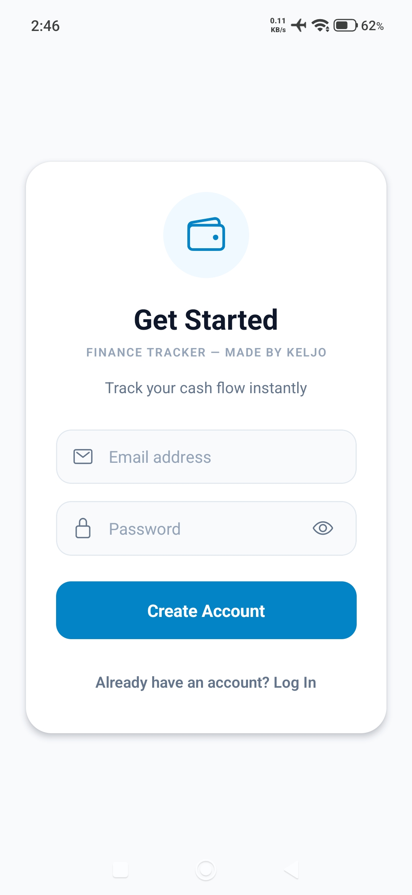
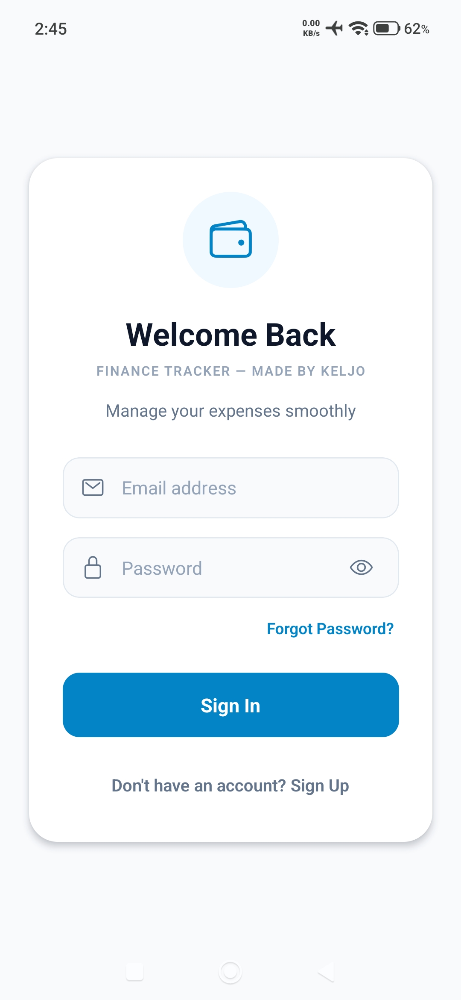
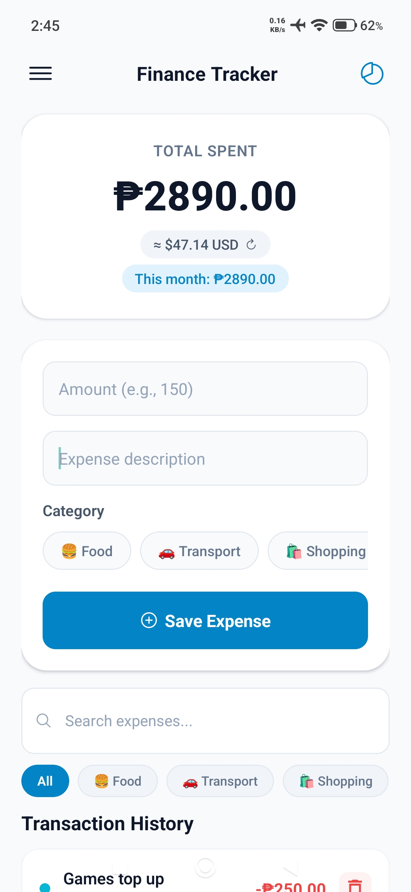
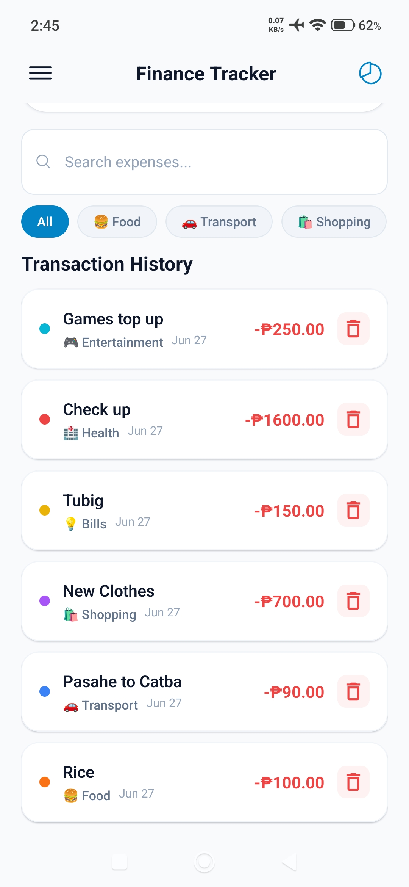
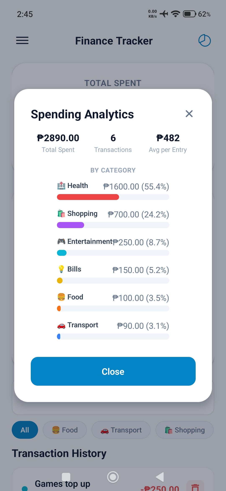
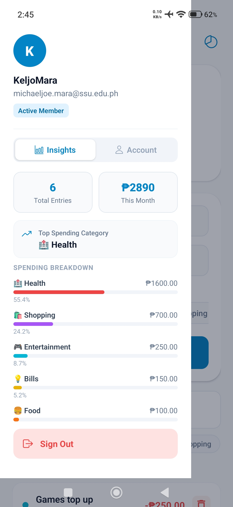
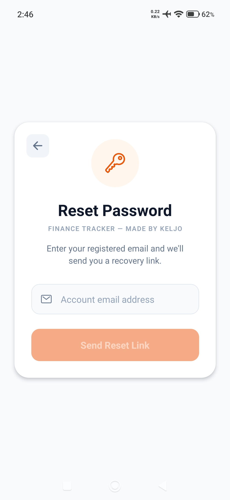

# Finance Tracker
A cross-platform mobile app built with React Native, Expo, and Firebase for tracking personal finances with PHP/USD conversion.

## Screenshots

<table>
  <tr>
    <td align="center"><b>Create Account</b> </td>
    <td align="center"><b>Login</b> </td>
    <td align="center"><b>Dashboard</b> </td>
  </tr>
  <tr>
    <td align="center"><b>History</b> </td>
    <td align="center"><b>Analytics</b> </td>
    <td align="center"><b>Settings</b> </td>
  </tr>
  <tr>
    <td align="center"><b>Reset Password</b> </td>
  </tr>
</table>

🔗 **Test the app:** [Download the App](https://drive.google.com/file/d/1AueWTES-Sr90VrYuXoCMjZaLKSvMhq7S/view?usp=drivesdk)
